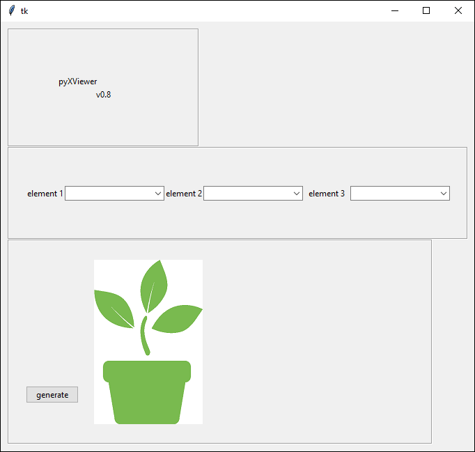
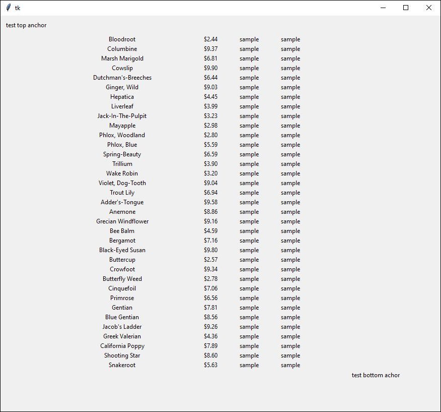

## pyXViewer

pyXViewer is a python application to read and compare specific elements of an xml file.  
It runs using the tkinter library.  

----


simply run the plantbow.py script then select the desired options and hit 'genereate'



this will create a new window with all the desired data
 
----
##### Still to do:
1. support multiple xml
1. ##### extra windows with tkinter
1. refactoring


>current
```
support other types of xml
increase supported xml capacity

get new preivew images that are up to date
make this readme page look decent and not messy
```
